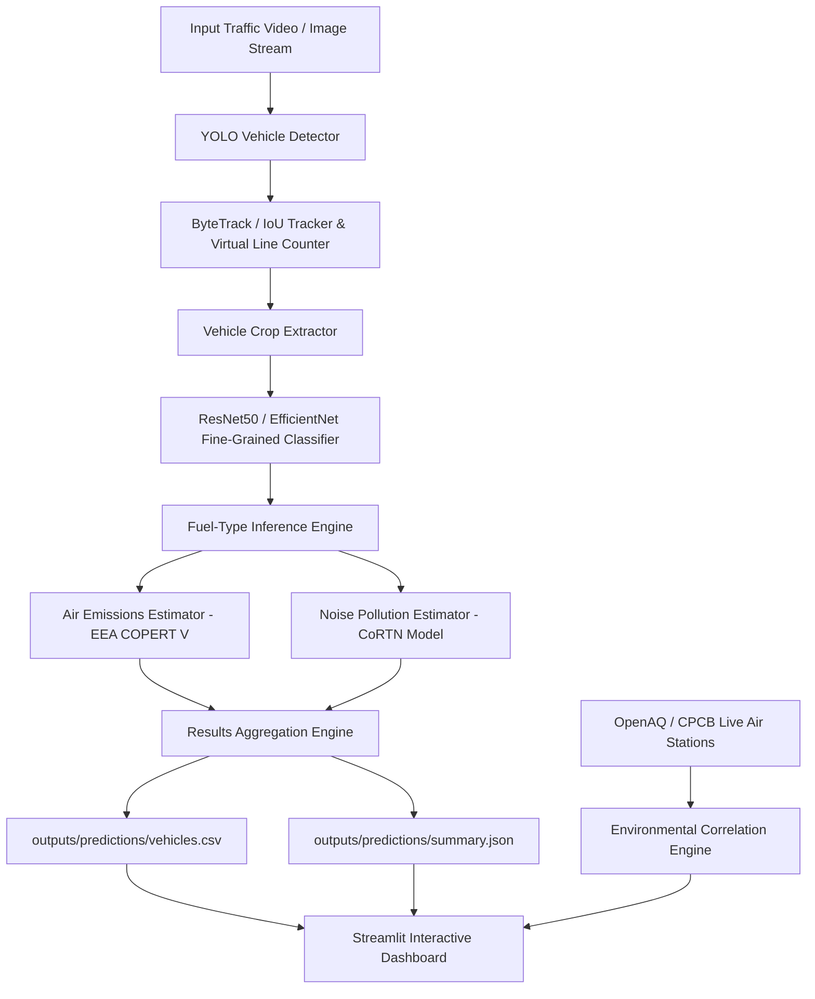

# System Architecture & Technical Design

## System Architecture Diagram

## System Components

1. **Detection Engine (`src/detection/`)**:
   - YOLOv8 architecture optimized for vehicle localization (`car`, `truck`, `bus`, `motorcycle`, `van`).
   - PyTorch FasterRCNN fallback.

2. **Tracking & Line Counting (`src/tracking/`)**:
   - Persistent ID tracking via ByteTrack / IoU.
   - 2D line segment crossing intersection logic (`VirtualCountingLine`).
   - Dwell time & traffic density calculator.

3. **Fine-Grained Classification & Explainability (`src/classification/`)**:
   - ResNet50 / EfficientNet-B0 transfer learning backbones for vehicle make/model recognition.
   - Grad-CAM heatmap visualization for model explainability.

4. **Fuel-Type Inference (`src/fuel_mapping/`)**:
   - Hierarchical fuel mapper translating make/model to standard labels (`PETROL`, `DIESEL`, `EV`, `CNG_LPG`, `HYBRID`, `UNKNOWN`, `AMBIGUOUS`).

5. **Air Pollution Estimation Engine (`src/pollution/`)**:
   - Sourced EEA COPERT V emission factors ($g/km$) calculating mass emission rates ($g/hr$).
   - 0-100 Vehicle Pollution Contribution Index.

6. **Noise Pollution Estimation Engine (`src/noise/`)**:
   - CoRTN traffic acoustic weighting model.
   - 0-100 Relative Noise Index and optional PyTorch 1D CNN waveform classifier.

7. **Environmental Data Integration (`src/environmental/`)**:
   - OpenAQ and CPCB ambient air quality adapters with offline station fallbacks.
   - Pearson ($r$) and Spearman ($\rho$) correlation analyzer.

8. **Unified Inference Pipeline & Dashboard (`src/pipeline.py` & `app/dashboard.py`)**:
   - End-to-end orchestration CLI and Streamlit multi-page dashboard UI.
