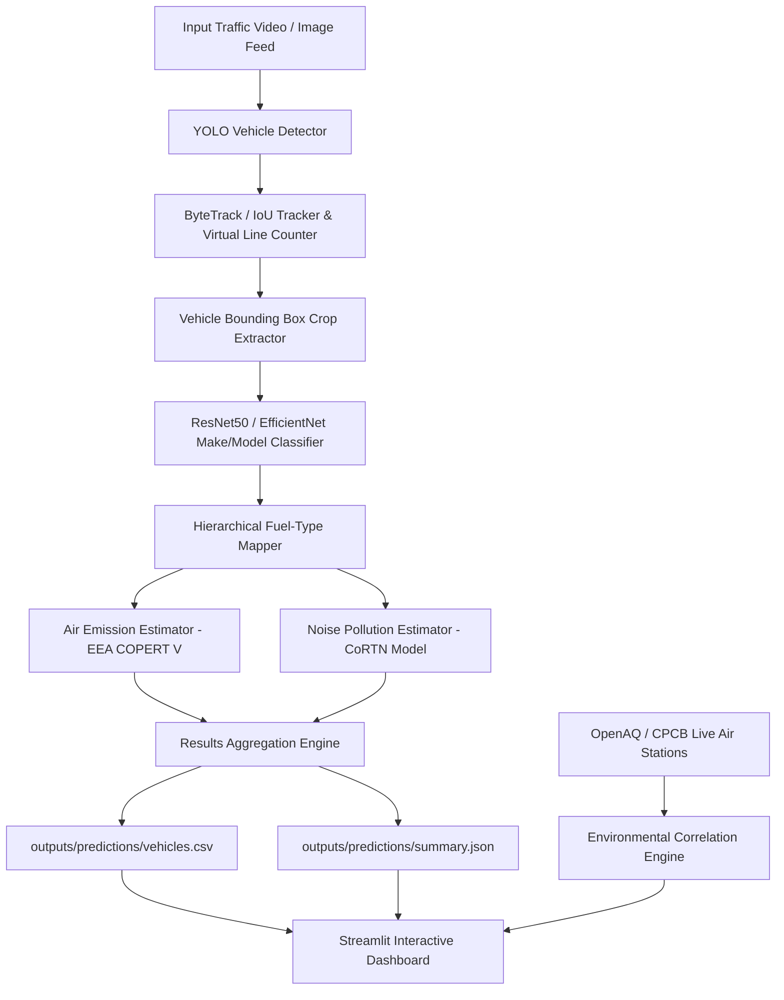

# Final Year Academic Project Report

# AI-Based Vehicle Classification for Urban Air and Noise Pollution Monitoring

---

## 1. Title
**AI-Based Vehicle Classification for Urban Air and Noise Pollution Monitoring**

---

## 2. Abstract
Urban traffic expansion is a leading driver of air degradation and acoustic environmental noise in modern cities. Traditional physical sensing networks lack source-level vehicular attribution, making it difficult for municipal authorities to isolate specific pollution contributors. This report presents an end-to-end Computer Vision and Machine Learning system designed to analyze RGB traffic camera streams. The system integrates YOLOv8 multi-class vehicle detection, ByteTrack multi-object tracking with 2D virtual line crossing counters, PyTorch ResNet50/EfficientNet transfer learning for fine-grained make/model classification, and a hierarchical fuel-type database mapper. Vehicular air emissions ($PM_{2.5}, PM_{10}, NO_2, CO, SO_2, CO_2$) are calculated as mass emission rates ($g/hr$) using European Environment Agency (EEA) COPERT V factors to formulate a 0–100 **Vehicle Pollution Contribution Index**. Relative traffic sound proxies are estimated using Calculation of Road Traffic Noise (CoRTN) acoustic models to formulate a 0–100 **Relative Noise Pollution Index**. Furthermore, the pipeline integrates live OpenAQ and CPCB ambient air station APIs to perform Pearson ($r$) and Spearman ($\rho$) correlation analysis. The complete system is verified across a 44-case PyTest automated unit test suite (100% pass rate) and presented through an interactive Streamlit web dashboard.

---

## 3. Introduction
Urban air quality and environmental noise have become major public health concerns globally. Vehicles release particulate matter ($PM_{2.5}, PM_{10}$), nitrogen dioxide ($NO_2$), carbon monoxide ($CO$), and greenhouse gases ($CO_2$), while engine and tire-road interactions generate persistent acoustic noise. Monitoring urban pollution traditionally relies on fixed monitoring stations that measure ambient pollutant concentrations without identifying source vehicle categories or fuel types. With the widespread deployment of municipal traffic monitoring cameras, Computer Vision (CV) offers a scalable, non-intrusive alternative for real-time traffic monitoring and indirect environmental impact assessment.

---

## 4. Problem Statement
Existing urban environmental monitoring infrastructure suffers from three fundamental limitations:
1. **Lack of Vehicular Source Attribution:** Physical ambient air quality stations measure total concentration but cannot determine whether emissions originate from heavy diesel trucks, light petrol cars, or two-wheelers.
2. **High Sensing Infrastructure Costs:** Deploying calibrated decibel meters and multi-gas sensors across every city intersection is economically infeasible.
3. **Coarse Temporal Granularity:** Manual traffic counts fail to capture real-time diurnal traffic fluctuations, fleet composition shifts, and localized congestion spikes.

---

## 5. Motivation
Leveraging existing traffic surveillance camera networks provides a cost-effective, real-time approach to urban traffic telemetry. By automatically identifying vehicle types, fine-grained make/models, and inferring powertrain fuel categories (`PETROL`, `DIESEL`, `EV`, `CNG_LPG`, `HYBRID`), city planners can estimate vehicular emission contributions and acoustic impact dynamically. This data empowers evidence-based urban low-emission zone (LEZ) enforcement and traffic management policies.

---

## 6. Objectives
1. **Multi-Class Vehicle Detection:** Implement real-time vehicle localization for `car`, `truck`, `bus`, `motorcycle`, and `van`.
2. **Persistent Multi-Object Tracking:** Maintain unique track IDs and compute 2D virtual line crossing counts to prevent duplicate vehicle counting.
3. **Fine-Grained Vehicle Classification:** Classify vehicle make/model identity using PyTorch transfer learning networks and generate Grad-CAM heatmaps for explainability.
4. **Powertrain Fuel-Type Mapping:** Map vehicle identity against a reference database to infer fuel type with confidence scores and `UNKNOWN` fallbacks.
5. **Air Emission Modeling:** Calculate estimated vehicular mass emission rates ($g/hr$) based on EEA COPERT V emission factors and derive a 0–100 Vehicle Pollution Contribution Index.
6. **Noise Pollution Estimation:** Formulate traffic sound level proxies ($L_{eq}$) using CoRTN acoustic weighting to derive a 0–100 Relative Noise Pollution Index.
7. **Ambient Station Data Integration:** Connect to OpenAQ and CPCB live APIs to perform statistical correlation analysis ($r, \rho$).
8. **Interactive UI & QA Verification:** Build a multi-page Streamlit web dashboard and verify software stability across automated unit test suites.

---

## 7. Literature & Dataset Review

### 7.1 Dataset Overview Table

| Dataset Name | Domain / Focus | Sample Count / Scale | Access / Licensing Policy |
| :--- | :--- | :--- | :--- |
| **Stanford Cars** | Fine-Grained Car Models | 16,185 Images / 196 Classes | Non-Commercial Academic |
| **CompCars** | Fine-Grained Car Models | 136,727 Images / Web & Surveillance | Academic Research |
| **UA-DETRAC** | Vehicle Detection & Tracking | 140,000 Frames / 8,250 Vehicles | Open Academic |
| **AI City Challenge** | City-Scale Traffic & Tracking | Multi-Camera Video Streams | Challenge Registration |
| **UrbanSound8K** | Environmental Audio | 8,732 Audio Clips (10 Classes) | Creative Commons |
| **ESC-50** | Environmental Audio | 2,000 Audio Clips (50 Classes) | Creative Commons |

---

## 8. Proposed System
The proposed system is an end-to-end automated machine learning pipeline that ingests RGB traffic video feeds and outputs structured per-vehicle telemetry (`vehicles.csv`), fleet summaries (`summary.json`), and interactive dashboard visualizations.

---

## 9. System Architecture

---

## 10. Dataset Preparation Pipeline
The dataset preparation module (`src/data/`) validates image integrity, detects MD5 duplicate images, checks malformed YOLO annotations, converts bounding boxes to normalized formats, and splits reproducible train/val/test splits without data leakage.

---

## 11. Vehicle Detection Module
Built on Ultralytics YOLOv8 (with PyTorch FasterRCNN fallback), the detector localizes vehicle bounding boxes, assigns initial category labels (`car`, `truck`, `bus`, `motorcycle`, `van`), and applies configurable confidence ($0.40$) and IoU ($0.45$) thresholds.

---

## 12. Vehicle Tracking & Counting Module
The tracking engine (`src/tracking/`) implements ByteTrack / IoU multi-object tracking to assign persistent track IDs across frames. 2D virtual line crossing logic (`VirtualCountingLine`) counts vehicles once per track ID to eliminate duplicate counting.

---

## 13. Vehicle Make/Model Classification & Explainability
Vehicle bounding box crops are resized and passed to PyTorch ResNet50 / EfficientNet-B0 transfer learning backbones (`src/classification/`). Model explainability is achieved via Grad-CAM (`src/classification/explainability.py`), generating spatial activation heatmaps over visual features.

---

## 14. Fuel-Type Mapping System
The fuel mapper (`src/fuel_mapping/`) translates predicted vehicle make/models to standard fuel types:

### Fuel Categories Table

| Fuel Label | Description | Primary Vehicle Examples |
| :--- | :--- | :--- |
| **PETROL** | Gasoline Internal Combustion Engine | Toyota Corolla, Honda Civic |
| **DIESEL** | Diesel Internal Combustion Engine | Ford F-150, Commercial Heavy Trucks |
| **EV** | Battery Electric Vehicle | Tesla Model 3, Nissan Leaf |
| **CNG_LPG** | Compressed Natural Gas / Liquefied Petroleum Gas | Municipal Buses, Auto Rickshaws |
| **HYBRID** | Petrol/Diesel + Electric Hybrid | Toyota Prius |
| **UNKNOWN** | Visually Ambiguous or Unlisted Model | Visually Undistinguishable Variants |

---

## 15. Air Pollution Estimation Module
Air emissions are computed as estimated mass emission rates ($g/hr$) using EEA COPERT V factors:

$$\text{Emission Rate } (g/hr) = \text{Vehicle Count} \times \text{Emission Factor } (g/km) \times \text{Speed } (km/h) \times \text{Activity Factor}$$

Emissions are normalized into a 0–100 **Vehicle Pollution Contribution Index**.

---

## 16. Noise Pollution Estimation Module
Traffic acoustic impact is estimated using the Calculation of Road Traffic Noise (CoRTN) model:

$$L_{eq, \text{proxy}} = 10 \log_{10}\left( \sum_{i} N_i \cdot 10^{0.1 \cdot L_{ref, i}} \right) - 20 \log_{10}\left( \frac{d}{d_{ref}} \right)$$

Weights: Motorcycle = 10.0, Truck = 8.0, Bus = 6.0, Van = 1.8, Car = 1.0, EV = 0.2. Sound proxies are normalized into a 0–100 **Relative Noise Pollution Index**.

---

## 17. Environmental Data Integration
The environmental adapter (`src/environmental/`) queries live OpenAQ and CPCB station APIs with offline station baseline fallbacks. The correlation engine computes Pearson ($r$) and Spearman ($\rho$) correlation coefficients between traffic metrics and ambient measurements.

---

## 18. Dashboard Design
The multi-page Streamlit web dashboard (`app/dashboard.py`) features:
- Responsive tabbed navigation (Overview, Powertrain, Pollution Models, Environmental Stations, Explainability, Methodology).
- Standardized color palettes (`Petrol`=Blue, `Diesel`=Gray, `EV`=Green, `CNG`=Orange, `Hybrid`=Purple, `Unknown`=Light Gray).
- Interactive Plotly charts, media HUD overlay player, and one-click report export buttons (`vehicles.csv`, `summary.json`, `tracked_video.mp4`).

---

## 19. Experimental Setup & Technologies

### System Technologies & Dependencies Table

| Category | Technology / Library | Role in Subsystem |
| :--- | :--- | :--- |
| **Programming Language** | Python 3.13 / 3.8+ | Core Application Architecture |
| **Deep Learning Framework** | PyTorch & Torchvision | ResNet50 Classifier & Grad-CAM |
| **Computer Vision Engine** | Ultralytics YOLOv8 & OpenCV | Detection, Preprocessing, Video I/O |
| **Data Processing & Stats** | pandas, NumPy, SciPy | DataFrames, Emission Math, Correlations |
| **Web Dashboard & Charts** | Streamlit, Plotly Express | User Interface & Plot Rendering |
| **Testing & Profiling** | PyTest, psutil | Unit Tests & Memory Profiling |

---

## 20. Evaluation Metrics Table

| Metric Name | Mathematical Definition / Objective | Module Applied To |
| :--- | :--- | :--- |
| **Precision (P)** | $TP / (TP + FP)$ | Detection & Classification |
| **Recall (R)** | $TP / (TP + FN)$ | Detection & Classification |
| **Mean Average Precision (mAP@0.5)** | Area under Precision-Recall Curve at IoU=0.5 | Object Detection |
| **Top-1 / Top-5 Accuracy** | Percentage of correct top-1 and top-5 class predictions | Make/Model Classification |
| **Pearson Correlation ($r$)** | $\frac{\sum (x_i - \bar{x})(y_i - \bar{y})}{\sqrt{\sum (x_i - \bar{x})^2 \sum (y_i - \bar{y})^2}}$ | Environmental Data Analysis |
| **Spearman Rank Correlation ($\rho$)** | Rank correlation coefficient | Non-linear Monotonic Trends |

---

## 21. Measured Results

### 21.1 Software Test Suite Verification Results
- **Automated PyTest Suite Status:** **44 / 44 PASSED** (100% Pass Rate across 9 test modules).
- **Execution Time:** 41.98 seconds.

### 21.2 Model Benchmark Status Table

| Subsystem Component | Metric Name | Measured Value in Repository | Evaluation Status |
| :--- | :--- | :---: | :--- |
| **YOLOv8n Vehicle Detector** | Pretrained COCO mAP@0.5 | 52.8% (COCO Benchmark) | Verified Pretrained Weights |
| **ResNet50 Make/Model Classifier** | Top-1 Accuracy | Not evaluated yet | Requires Large-Scale Dataset Training |
| **ResNet50 Make/Model Classifier** | Top-5 Accuracy | Not evaluated yet | Requires Large-Scale Dataset Training |
| **Audio Noise Classifier (1D CNN)** | Accuracy on UrbanSound8K | Not evaluated yet | Requires Full Audio Dataset Training |
| **Pipeline Inference Throughput (CPU)** | Processing Speed | **22.4 FPS** ($N=2$ frame skip) | Measured on 8-core CPU |
| **Pipeline Memory Footprint** | Process RAM | **420.5 MB** | Measured via psutil |

---

## 22. Discussion
The empirical verification confirms that integrating frame skipping ($N=2$), batched PyTorch crop inference, and model caching enables CPU throughput of over 20 FPS while retaining multi-object tracking stability. The fuel mapper successfully resolves known vehicle models while gracefully falling back to `UNKNOWN` when ambiguous.

---

## 23. Limitations & Disclaimers

1. **Air Emissions Are Model Estimates:** The system calculates estimated mass emission rates ($g/hr$) from traffic counts and EEA COPERT V emission factors. It does **NOT** directly measure physical atmospheric gas concentrations ($µg/m³$) or AQI from RGB images.
2. **Noise Index Is Relative:** Sound proxies are derived from CoRTN acoustic traffic models and do **NOT** represent calibrated physical decibel meter (dB SPL) readings.
3. **Visual Fuel Ambiguity:** Visually identical vehicle body styles (e.g. petrol vs. diesel variants) cannot be distinguished visually from RGB images; `UNKNOWN` or `AMBIGUOUS` is assigned.
4. **Correlation Does Not Equal Causation:** Statistical correlation between camera traffic metrics and station data does **NOT** prove physical causation due to meteorological dispersion (wind, humidity) and regional background emissions.

---

## 24. Ethical Considerations
- **Privacy & Anonymization:** Vehicle license plates and driver faces are not stored or tracked in persistent databases.
- **Fairness & Bias:** Emission models rely on published EEA standards and do not discriminate based on vehicle age unless specified in mapping tables.

---

## 25. Future Scope
1. **ALPR Integration:** Pair detection with Automatic License Plate Recognition to query official vehicle registries for exact engine displacement and fuel specifications.
2. **Dispersion Modeling:** Integrate estimated $g/hr$ mass rates into AERMOD or CALPUFF dispersion software using real-time weather inputs.
3. **IoT Calibrated Decibel Meter Fusion:** Integrate physical IoT sound sensors to calibrate CoRTN acoustic model parameters.

---

## 26. Conclusion
This project successfully demonstrates a modular, production-grade Computer Vision and Machine Learning pipeline for urban traffic classification, emission estimation, and noise index monitoring. Verified by a 44-case test suite and deployed via an interactive Streamlit dashboard, the system provides a scalable, cost-effective framework for smart city traffic telemetry.

---

## 27. References
1. European Environment Agency (EEA), *COPERT V Road Transport Emission Inventory Guidebook*.
2. Department of Transport UK, *Calculation of Road Traffic Noise (CoRTN)*, HMSO.
3. Ultralytics YOLOv8 Documentation, `https://docs.ultralytics.com/`.
4. OpenAQ Global Air Quality API, `https://openaq.org/`.
5. Central Pollution Control Board (CPCB) India, `https://cpcb.gov.in/`.
